# QA_Agent


<p><strong><font size="5">QA_Agent 是一个面向技术面试准备的个人资料驱动训练工作台。它把用户已有的 Markdown 笔记、项目总结和复习资料沉淀为可管理、可生成、可练习、可反馈、可评估、可记忆的问答资产。</font></strong></p>

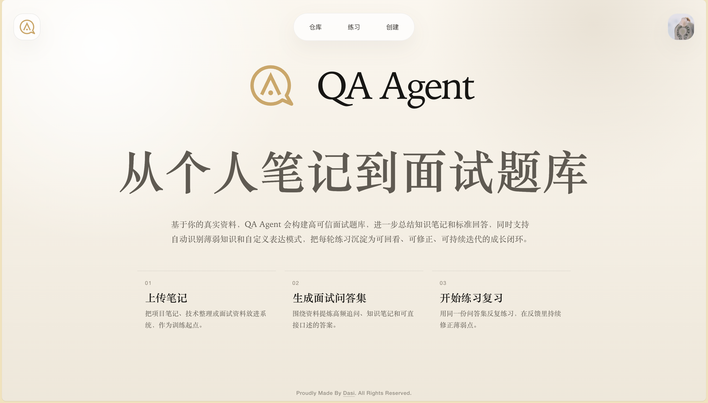

## 项目概览

普通 AI 聊天很容易停留在一次性问答，普通题库又很难贴合个人真实经历。QA_Agent 关注的是另一条路径：先让资料成为稳定资产，再围绕资产建立训练闭环，最后用 Agent、RAG 和 Memory 提升生成质量与长期训练效果。

QA_Agent 的核心不是让模型自由发挥，而是让模型围绕用户资料、求职画像、题集资产和练习记录工作。一次生成不是终点，题集可以继续维护，题目可以继续补全，练习可以继续复盘，记忆可以进入下一轮生成与训练。

| 领域 | 技术 |
| --- | --- |
| 前端 | React, Vite, TypeScript, React Router, TanStack Query |
| 后端 | Java 17, Spring Boot 3, MyBatis-Plus, Maven |
| Agent | LangChain4J, Agent DAG, Server-Sent Events |
| RAG | DashScope Embedding, PostgreSQL pgvector, zhparser, Hybrid Retrieval |
| 基础设施 | MySQL, PostgreSQL, Redis, Kafka, XXL-JOB |

<p align="center"><strong>⭐ GitHub Star 变化趋势</strong></p>
<p align="center">
  <a href="https://star-history.com/#dasi0227/QA-Agent&Date">
    
  </a>
</p>

## 核心能力

- **个人画像**：维护目标岗位、目标领域、表达风格和模型配置，让 Agent 拥有稳定的用户上下文。
- **资料驱动生成**：从用户资料出发生成问答集，降低泛化内容和无证据回答的比例。
- **RAG 证据检索**：结合向量检索、中文全文检索和重排序，为生成、补全和反馈提供资料证据。
- **Agent 问答集生成**：通过 LangChain4J 组织多阶段 Agent DAG，覆盖规划、起草、校验、修订和总结。
- **实时生成进度**：使用 SSE 推送生成阶段、状态、消息和 token 统计，让长任务过程可见。
- **练习与反馈**：支持顺序练习、随机练习、逐题反馈和整轮反馈，把题集转化为持续训练入口。
- **评估与记忆**：基于整轮练习生成诊断、建议和长期记忆画像，沉淀用户薄弱点与优势模块。
- **Dasi 临时助手**：提供轻量临时对话入口，用于围绕当前学习和训练上下文进行辅助问答。

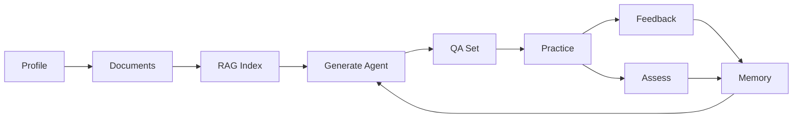

## 项目结构

```text
QA_Agent/
├── frontend/                       # React 前端工作台
│   ├── src/pages/                  # 页面入口：资料库、题集、练习、结果、登录与用户设置
│   ├── src/components/             # 通用组件、布局组件、练习组件和 Dasi 对话组件
│   ├── src/lib/                    # API 请求、鉴权、路由辅助、错误处理和 Markdown 渲染
│   └── src/styles/                 # 全局样式、页面样式、组件样式和响应式规则
├── backend/                        # Spring Boot 后端工程
│   ├── qa-agent-application/       # 启动与装配模块
│   ├── qa-agent-interfaces/        # 接口层与消息入口
│   ├── qa-agent-domain/            # 领域服务、RAG 与 Agent 链路
│   │   ├── agent/                  # 生成、补全、反馈、评估、记忆和临时对话 Agent
│   │   ├── document/               # 资料管理、Markdown 切片、索引和 RAG 检索
│   │   ├── qa/                     # 问答集、题目、导入导出和题目补全
│   │   ├── practice/               # 练习会话、答题流程、提交、重开和回看
│   │   ├── memory/                 # 用户长期记忆查询、隐藏和证据管理
│   │   ├── identity/               # 账号、Profile 和用户配置
│   │   └── message/                # 异步消息任务和未解决任务记录
│   ├── qa-agent-infrastructure/    # 持久化、外部服务与技术实现
│   └── qa-agent-types/             # DTO、枚举、异常与通用类型
└── docs/                           # 产品、接口、数据表和阶段设计文档
```

## 快速启动

1. 启动基础设施

   ```bash
   cd backend/docker
   docker compose --env-file ../.env up -d
   ```
   
    > 注意先要填写好自己的环境变量 .env 文件。 

2. 初始化数据库

   ```bash
   docker compose --env-file ../.env exec -T mysql sh -lc 'mysql -u"$MYSQL_USER" -p"$MYSQL_PASSWORD" "$MYSQL_DATABASE"' < init_mysql.sql
   docker compose --env-file ../.env exec -T postgresql sh -lc 'psql -U "$POSTGRES_USER" -d "$POSTGRES_DB"' < init_postgres.sql
   ```
   
    > PostgreSQL 检索库需要同时启用 `pgvector` 和 `zhparser`。`pgvector` 用于向量检索，`zhparser` 用于中文全文检索分词，可从 [amutu/zhparser](https://github.com/amutu/zhparser.git) 构建安装。

3. 启动后端

   ```bash
   cd backend
   mvn spring-boot:run -pl qa-agent-application -am
   ```

   > 默认后端地址：http://localhost:8080/qa-agent/api/v1

4. 启动前端

   ```bash
   cd frontend
   npm install
   npm run dev
   ```

## 运行截图

<table>
  <tr>
    <td align="center">
      <p>登录后进入系统</p>
      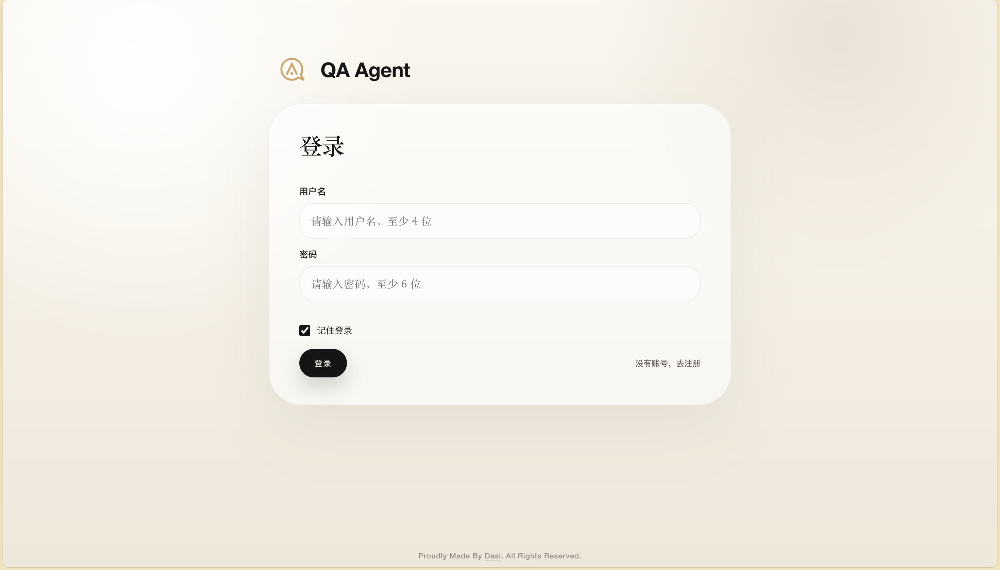
    </td>
    <td align="center">
      <p>主页总览训练入口</p>
      
    </td>
  </tr>
  <tr>
    <td align="center">
      <p>管理个人信息与配置</p>
      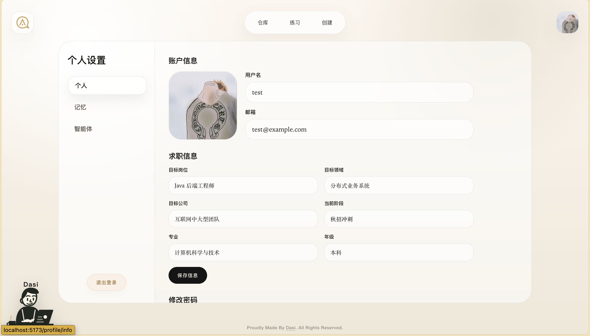
    </td>
    <td align="center">
      <p>资料库管理学习材料</p>
      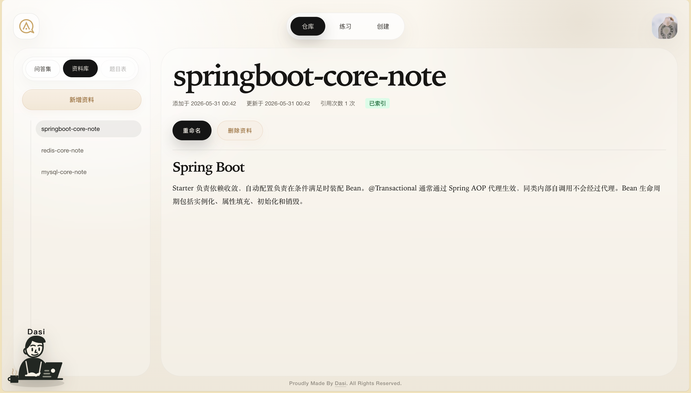
    </td>
  </tr>
  <tr>
    <td align="center">
      <p>新建问答集任务</p>
      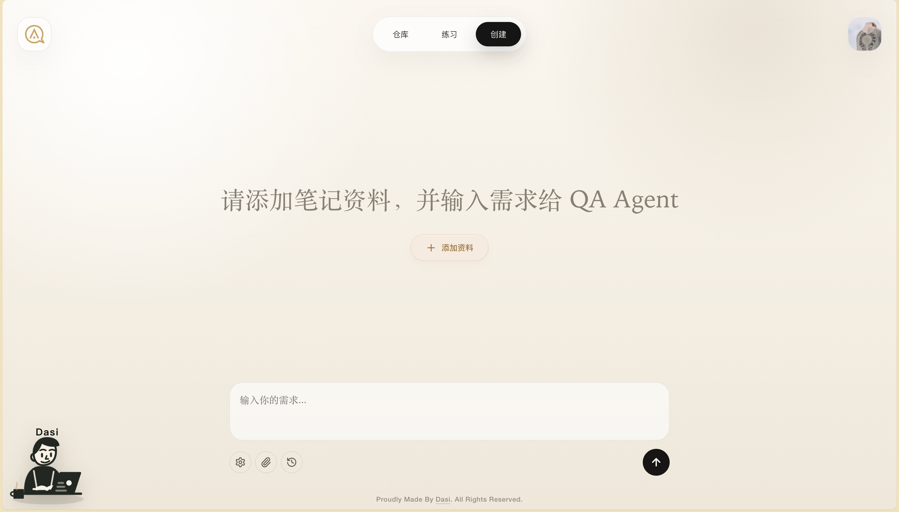
    </td>
    <td align="center">
      <p>查看题集仓库列表</p>
      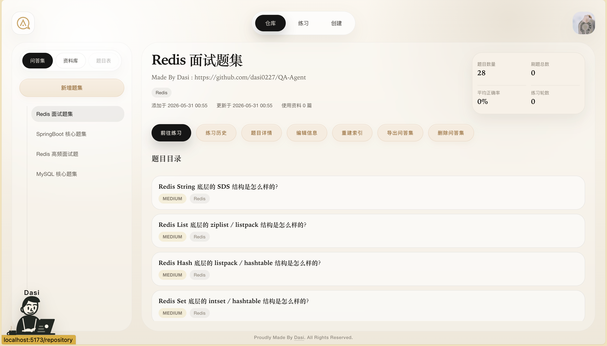
    </td>
  </tr>
  <tr>
    <td align="center">
      <p>浏览题目与详情</p>
      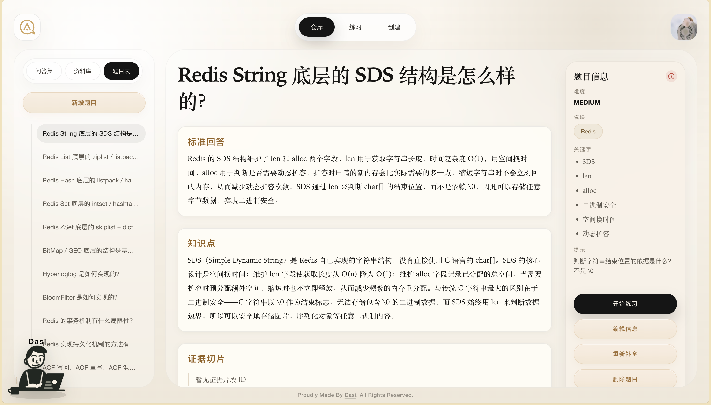
    </td>
    <td align="center">
      <p>执行题目测试流程</p>
      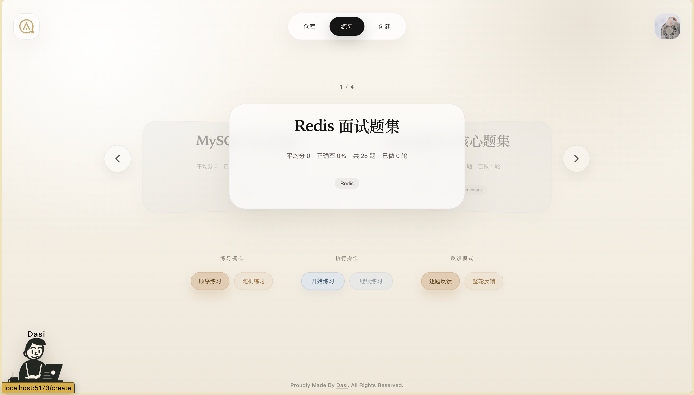
    </td>
  </tr>
  <tr>
    <td align="center">
      <p>进入练习作答</p>
      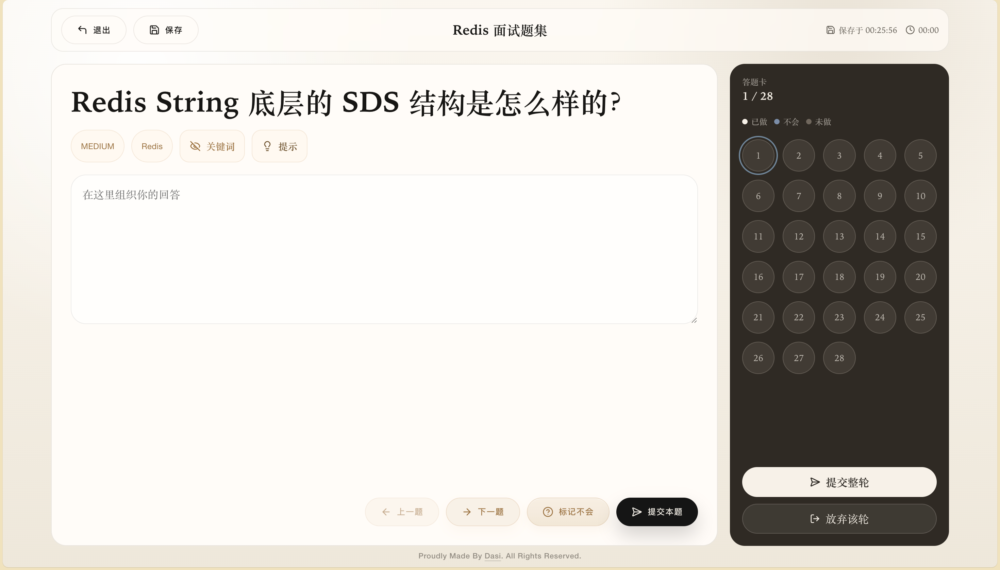
    </td>
    <td align="center">
      <p>查看答题反馈</p>
      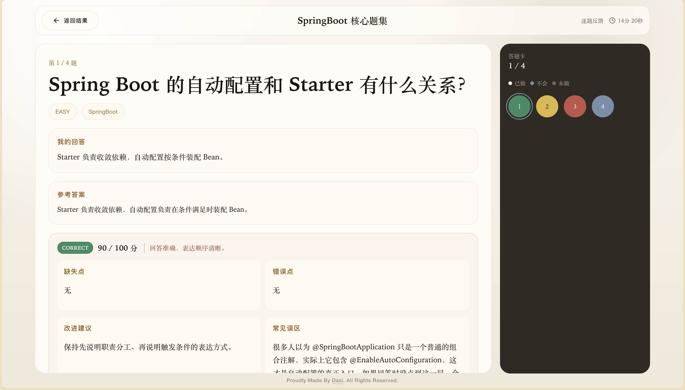
    </td>
  </tr>
  <tr>
    <td align="center">
      <p>查看能力评估结果</p>
      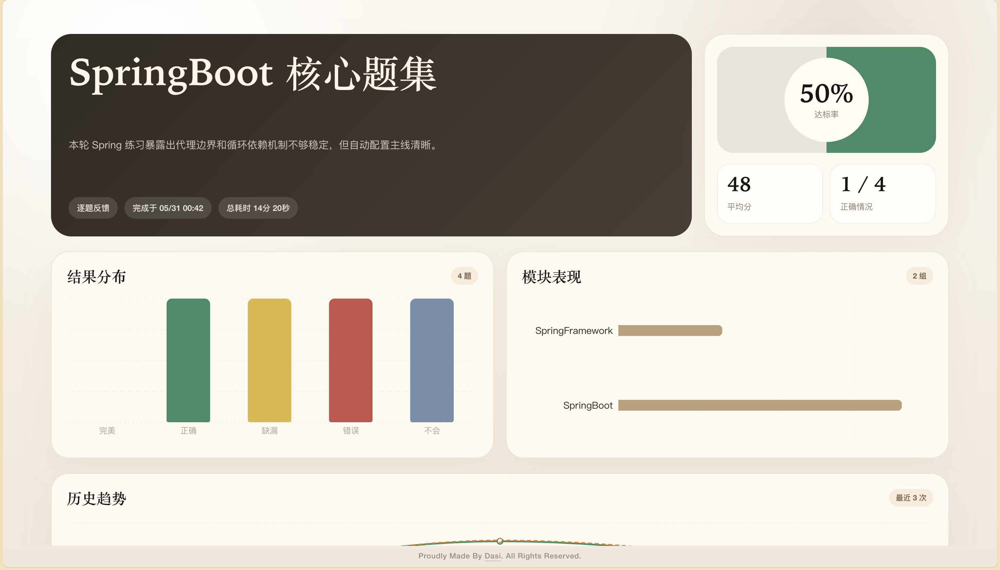
    </td>
    <td align="center">
      <p>沉淀长期记忆</p>
      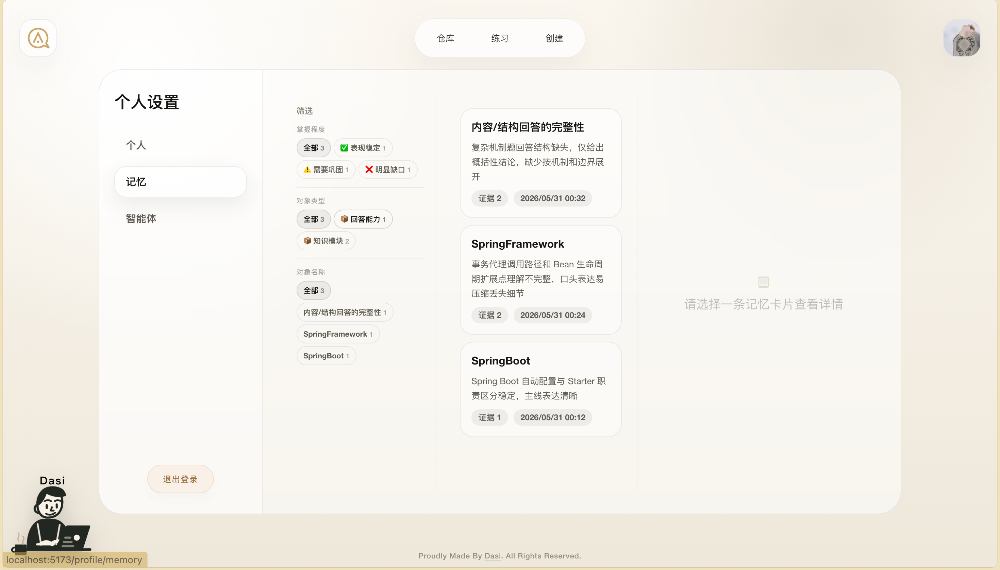
    </td>
  </tr>
</table>

## 版权声明

本项目采用 MIT License 开源，允许任何个人或组织在遵守许可证条款的前提下使用、复制、修改、合并与发布本项目代码，但作者不对其适用性或潜在风险承担担保责任。

<div align="center">
  <p><strong><font size="6">🚨🚨🚨 资源说明 🚨🚨🚨</font></strong></p>
  <p><strong><font size="5">以下文件类型不在本仓库开源范围内</font></strong></p>

  <table align="center">
    <tr>
      <td align="center"><strong><font size="4">❗ <code>.txt</code> 提示词文件</font></strong></td>
      <td align="center"><strong><font size="4">❗ <code>.dasi</code> 题集文件</font></strong></td>
      <td align="center"><strong><font size="4">❗ <code>.sql</code> 数据库文件</font></strong></td>
    </tr>
  </table>

  <p><strong><font size="5">如需获取，请关注小红书账号</font></strong></p>
  <p><strong><font size="7" color="#ff2d55">dasi0227</font></strong></p>
  <p><strong><font size="5">私信联系</font></strong></p>
</div>
