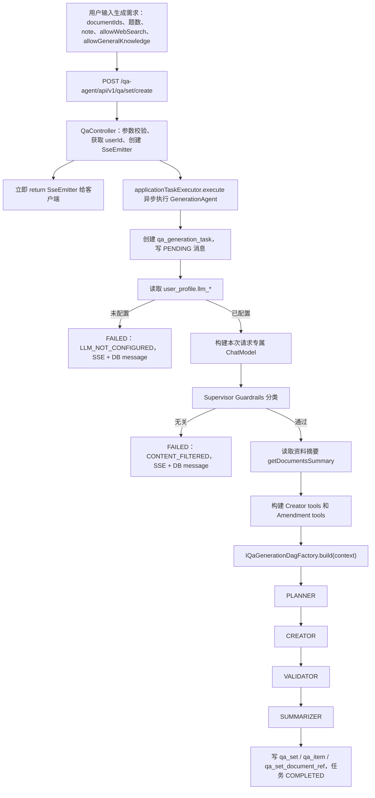
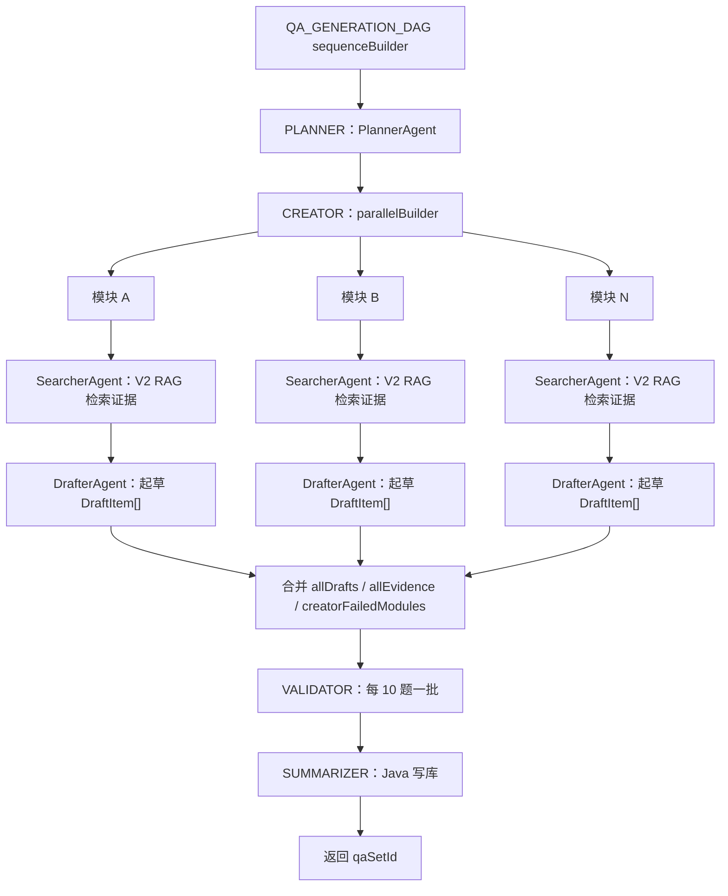
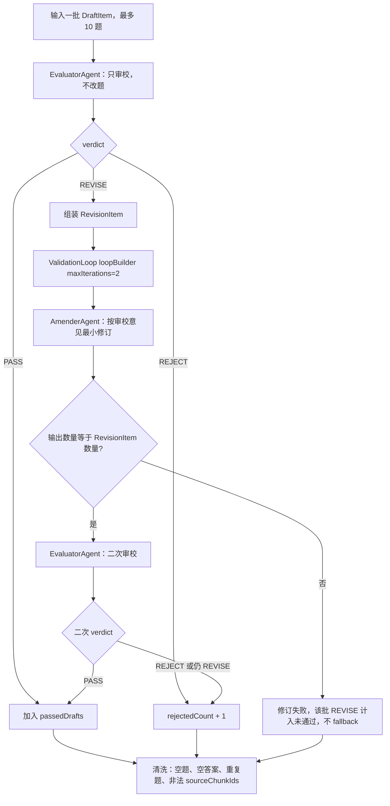

# V3 GenerateAgent 后端落地规格

本文档是 V3 “资料 -> 问答集”生成链路的唯一当前规格，已合并 V3.1 的 Validator 阶段职责拆分设计。代码实现以当前 `V3` 分支为准：每次请求读取用户 LLM 配置后，动态构建本次任务专用的 LangChain4j AgenticServices DAG。

## 1. 目标与边界

V3 只负责一件事：用户选择学习资料后，自动生成结构化技术面试问答集。

必须满足：

1. 题目围绕用户选择的资料生成，保留证据边界和 `sourceChunkIds`。
2. 生成链路固定为 `Planner -> Creator -> Validator -> Summarizer`。
3. Creator 内部按模块并发，每个模块执行 `SearcherAgent -> DrafterAgent`。
4. Validator 内部执行 `EvaluatorAgent -> AmenderAgent -> EvaluatorAgent`，最多修订一次。
5. 用户模型只从 `user_profile.llm_base_url`、`llm_api_key`、`llm_model_name` 读取；缺失时抛 `LLM_NOT_CONFIGURED` 并置任务失败。
6. 对外 API 只扩展已有 `QaController`，不新增 Controller。
7. SSE 事件实时推送阶段消息，并持久化到 `qa_generation_task_message`。

本阶段不做真实 LLM 的 2 文档 5 题端到端验收，不做前端联调，不做语义相似度去重，不引入默认模型降级。

## 2. 完整执行链路



## 3. AgenticServices DAG

顶层 DAG 使用 untyped `sequenceBuilder()`：

```text
QA_GENERATION_DAG
  PLANNER action
  CREATOR action
  VALIDATOR action
  SUMMARIZER action
```

整体图：



Validator 内部使用 `loopBuilder()`：



`QaGenDag`、`QaGenModule`、`ValidationLoop` 保留为语义标记接口，帮助代码和文档表达边界；当前不强制作为 typed builder 的运行时入口。

## 4. Agent 职责

| Agent | 阶段 | 职责 | 是否生成新题 | 是否修改题目 | 输出 |
| --- | --- | --- | --- | --- | --- |
| `PlannerAgent` | `PLANNER` | 资料结构分析和题集规划 | 否 | 否 | `PlanResult` |
| `SearcherAgent` | `CREATOR` | 调 V2 `ISearchService` 检索证据 | 否 | 否 | `List<SearchResult>` |
| `DrafterAgent` | `CREATOR` | 基于证据起草首版题目 | 是 | 否 | `DraftItem[]` JSON 字符串 |
| `EvaluatorAgent` | `VALIDATOR` | 审校并判定 `PASS / REVISE / REJECT` | 否 | 否 | `ValidationResult[]` JSON 字符串 |
| `AmenderAgent` | `VALIDATOR` | 按审校意见最小修订 `REVISE` 项 | 否 | 是 | `DraftItem[]` JSON 字符串 |
| `SummarizerAgent` | `SUMMARIZER` | 纯 Java 写库和完成消息 | 否 | 否 | `qaSetId` 和完成摘要 |

`DrafterAgent`、`EvaluatorAgent`、`AmenderAgent` 返回 JSON `String`，由后端使用 fastjson2 解析。当前 LangChain4j 版本对集合型 POJO 输出解析存在不稳定风险，直接返回 JSON 字符串更可控。

## 5. 关键文件

```text
backend/qa-agent-domain/src/main/java/com/dasi/qa/agent/domain/agent/
  model/
    DraftItem.java
    PlanResult.java
    PlanItem.java
    ValidationResult.java
    RevisionItem.java
    UserLlmConfig.java
  repository/IAgentRepository.java
  service/generate/agentic/
    GenerationAgent.java
    ValidationCoordinator.java
    QaGenerationDagContext.java
    IQaGenerationDagFactory.java
  service/generate/subagent/
    PlannerAgent.java
    SearcherAgent.java
    DrafterAgent.java
    EvaluatorAgent.java
    AmenderAgent.java
    SummarizerAgent.java
    SupervisorAgent.java
  service/generate/tool/
    RagSearchTool.java
    InterviewExperienceSearchTool.java

backend/qa-agent-application/src/main/java/com/dasi/qa/agent/application/configuration/
  AgentConfiguration.java
  SupervisorLlmConfiguration.java

backend/qa-agent-application/src/main/resources/prompt/
  generation-plan.txt
  generation-draft.txt
  generation-evaluate.txt
  generation-amend.txt
  supervisor-classify.txt
  supervisor-summary.txt
  web-search-system.txt

backend/qa-agent-interfaces/src/main/java/com/dasi/qa/agent/interfaces/controller/QaController.java
```

## 6. API 约定

基础路径由网关或全局配置提供：`/qa-agent/api/v1`。

V2 检索保持：

```text
POST /qa-agent/api/v1/document/source/search
```

V3 生成接口：

```text
POST /qa-agent/api/v1/qa/set/create
GET  /qa-agent/api/v1/qa/set/task-status?taskId=...
GET  /qa-agent/api/v1/qa/set/task-messages?taskId=...
```

`POST /qa/set/create` 返回 `SseEmitter`。请求线程只做参数校验、用户识别、emitter 创建和异步任务提交，不执行 LLM、RAG 或 DAG。

请求字段：

```json
{
  "title": "Redis 面试问答集",
  "note": "偏后端实习面试",
  "documentIds": ["document-id"],
  "requestedQuestionCount": 10,
  "allowGeneralKnowledge": false,
  "allowWebSearch": true
}
```

SSE 事件结构：

```json
{
  "taskId": "uuid",
  "stage": "VALIDATOR",
  "status": "PROCESSING",
  "message": "已完成本批题目审校和修订。",
  "timestamp": 1717000000000,
  "tokens": {
    "current": 1200,
    "total": 2400
  }
}
```

对外 `stage` 只使用 `GenerationStage`：`PENDING`、`PLANNER`、`CREATOR`、`VALIDATOR`、`SUMMARIZER`、`COMPLETED`、`FAILED`。`EvaluatorAgent` 和 `AmenderAgent` 的 SSE stage 都归并为 `VALIDATOR`。

## 7. 数据与配置

`user_profile` 已扩展用户自配 LLM 字段：

```sql
llm_base_url
llm_api_key
llm_model_name
```

V3 任务表：

```text
qa_generation_task
qa_generation_task_message
qa_set_document_ref
```

系统模型配置：

```yaml
qa-agent:
  llm:
    supervisor:
      base-url: ${SUPERVISOR_LLM_BASE_URL}
      api-key: ${SUPERVISOR_LLM_API_KEY}
      model: ${SUPERVISOR_LLM_MODEL}
    web-search:
      base-url: ${WEB_SEARCH_LLM_BASE_URL}
      api-key: ${WEB_SEARCH_LLM_API_KEY}
      model: ${WEB_SEARCH_LLM_MODEL}
```

`.env` 只维护：

```bash
SUPERVISOR_LLM_BASE_URL=
SUPERVISOR_LLM_API_KEY=
SUPERVISOR_LLM_MODEL=
WEB_SEARCH_LLM_BASE_URL=
WEB_SEARCH_LLM_API_KEY=
WEB_SEARCH_LLM_MODEL=
```

## 8. 阶段规则

### 8.1 Planner

1. 只规划，不生成题目。
2. `planItems.questionCount` 总和必须等于请求题数。
3. 难度分布必须满足 `easy + medium + hard = questionCount`。
4. 资料不足时仍输出计划，但把风险写入模块信息。

### 8.2 Creator

1. 按模块并发。
2. 每个模块先由 `SearcherAgent` 检索证据，再由 `DrafterAgent` 按 10 题一批生成。
3. 模块失败时记录 `creatorFailedModules`，其他模块继续。
4. `allowGeneralKnowledge=false` 时，Drafter 必须严格基于资料证据；证据不足只能写 `conflictTip`，不能把资料外事实写成确定结论。

### 8.3 Validator

1. 每 10 题一批校验。
2. `EvaluatorAgent` 对每题输出 `PASS`、`REVISE`、`REJECT`。
3. `PASS` 保留。
4. `REJECT` 丢弃并计入拒绝数。
5. `REVISE` 组装为 `RevisionItem(itemIndex, draftItem, reason, revisionSuggestion)`，交给 `AmenderAgent` 最小修订一次，再由 `EvaluatorAgent` 二次审校。
6. `AmenderAgent` 输出数量必须等于 `RevisionItem` 数量；不匹配或调用失败时，该批修订项计入未通过，不 fallback 到 `DrafterAgent`。
7. 二次审校仍为 `REVISE` 或 `REJECT` 时，题目不进入最终结果。
8. 最终做基础清洗：空问题、空答案、重复问题、非法 `sourceChunkIds` 不落库。
9. 本阶段只做精确问题去重；语义相似度去重放到后续增强。

### 8.4 Summarizer

`SummarizerAgent` 是纯 Java 写库组件，不调用 LLM。

写入：

1. `qa_set`
2. `qa_item`
3. `qa_set_document_ref`
4. `qa_generation_task.status=COMPLETED`

完成消息包含：

1. 计划题数。
2. 实际通过题数。
3. 未通过或丢弃题数。
4. 模块分布。
5. 难度分布。
6. Creator 失败模块数。
7. 累计 token。

## 9. Guardrails、Listener、Token

Guardrails 分两层：

1. Controller 基础校验：`documentIds` 非空、`requestedQuestionCount <= 100`、`note.length <= 2000`。
2. Planner 前调用 Supervisor 模型分类：判断用户要求是否与“根据学习资料生成技术面试问答集”相关；无关则任务失败。

LLM 阶段统一注册 `AgentListener`：

1. 读取 `AgentResponse.chatResponse().tokenUsage()`。
2. 累计 `AtomicInteger totalTokens`。
3. 调 Supervisor 总结阶段输出。
4. 写 SLF4J。
5. 推 SSE。
6. 写 `qa_generation_task_message`。

Java action 阶段允许 `current=0`，但不能清空累计 token。

错误处理采用 `GenerationAgent` 集中式捕获和映射：

```text
NETWORK_ERROR
RATE_LIMITED
AUTH_FAILURE
INVALID_RESPONSE
CONTENT_FILTERED
ALL_REJECTED
LLM_NOT_CONFIGURED
UNKNOWN
```

## 10. 当前验收标准

本阶段只做后端验证，不跑真实 LLM 端到端。

静态检查：

```bash
cd /Users/wyw/Desktop/Project/QA_Agent
rg -n "generation-validate|ValidatorAgent|redraftRevisions|validateOnce" backend
rg -n "EvaluatorAgent|AmenderAgent|RevisionItem|generation-evaluate|generation-amend" backend docs/V3-GenerateAgent-Design.md
rg -n "/qa/set|/document/source" backend/qa-agent-interfaces docs/API.md docs/V3-GenerateAgent-Design.md
```

构建测试：

```bash
cd /Users/wyw/Desktop/Project/QA_Agent/backend
mvn test
mvn compile
mvn install -DskipTests
```

SQL 初始化：

```bash
cd /Users/wyw/Desktop/Project/QA_Agent
backend/script/init_sql.sh
```

启动验证：

```bash
cd /Users/wyw/Desktop/Project/QA_Agent/backend
mvn spring-boot:run -pl qa-agent-application -Dspring-boot.run.arguments="--server.port=18080 --qa-agent.xxl-job.port=19999"
```

预期：

1. 测试通过。
2. 编译通过。
3. SQL 初始化成功。
4. Spring Boot 正常启动。
5. V2 `/document/source/search` 不受影响。
6. V3 `/qa/set/create`、`/qa/set/task-status`、`/qa/set/task-messages` 映射注册成功。
7. SSE stage 仍然是 `VALIDATOR`，不会对外暴露 `EVALUATOR` 或 `AMENDER`。
