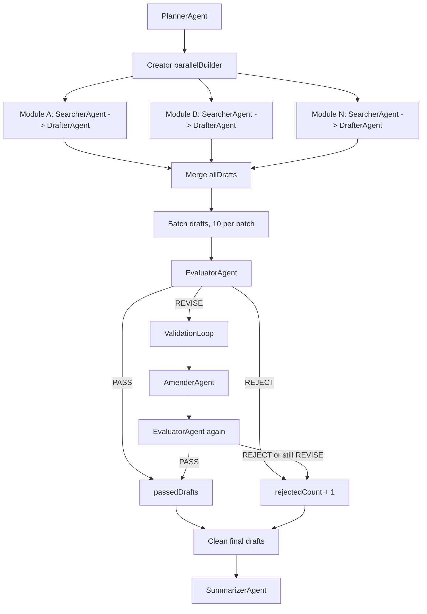

# V3.1 GenerateAgent Validator 阶段职责拆分设计说明书

本文档是在 V3 GenerateAgent 已落地的基础上，针对 Validator 阶段做职责拆分的 V3.1 设计。目标是把当前 `ValidatorAgent -> DrafterAgent -> ValidatorAgent` 的修订链路，升级为更清晰的 `EvaluatorAgent -> AmenderAgent -> EvaluatorAgent`。

本文档用于指导后续 agent 直接实施。除非本文档明确要求，不修改 API、数据库、前端和 V2 RAG。

## 1. 背景与目标

当前 V3 的整体链路已经成立：

```text
PLANNER
  PlannerAgent

CREATOR
  parallelBuilder(QaGenModule)
    SearcherAgent -> DrafterAgent

VALIDATOR
  ValidatorAgent -> DrafterAgent(redraft) -> ValidatorAgent

SUMMARIZER
  SummarizerAgent
```

这里的问题是：`DrafterAgent` 同时承担“首轮起草”和“按审校意见修订”两个职责。首轮起草偏生成，修订偏约束改写，两者 prompt 目标不同。复用同一个 Drafter 会带来以下风险：

1. 修订时可能重新创作，而不是最小必要修改。
2. 修订时可能改变题目数量、模块标签或证据引用边界。
3. Creator 质量问题和修订质量问题混在一起，日志和 SSE 难以区分。
4. Validator 阶段的职责表达不够清楚。

V3.1 目标是把 Validator 阶段内部拆成两个子 Agent：

```text
VALIDATOR
  EvaluatorAgent -> AmenderAgent -> EvaluatorAgent
```

阶段名仍然叫 `VALIDATOR`，对外 API、SSE stage、任务状态枚举都不变。

## 2. 最终 DAG

V3.1 的目标 DAG：

```text
PLANNER
  PlannerAgent

CREATOR
  parallelBuilder(QaGenModule)
    module branch:
      SearcherAgent
      DrafterAgent

VALIDATOR
  for each batch:
    EvaluatorAgent
    if has REVISE:
      loopBuilder(ValidationLoop)
        AmenderAgent
        EvaluatorAgent

SUMMARIZER
  SummarizerAgent
```

Mermaid 版本：



## 3. 命名与职责

### 3.1 阶段名

保留现有阶段名：

```text
GenerationStage.VALIDATOR
```

原因：

1. 对外 SSE stage 不变。
2. `qa_generation_task.stage` 不变。
3. `qa_generation_task_message.stage` 不变。
4. 前端和查询接口不需要适配。

### 3.2 子 Agent 命名

当前：

```text
ValidatorAgent
DrafterAgent(redraft)
```

目标：

```text
EvaluatorAgent
AmenderAgent
```

职责如下：

| Agent | 职责 | 是否生成新题 | 是否修改题目 | 输出 |
| --- | --- | --- | --- | --- |
| `DrafterAgent` | Creator 阶段首轮起草 | 是 | 否 | `DraftItem[]` JSON 字符串 |
| `EvaluatorAgent` | Validator 阶段审校判定 | 否 | 否 | `ValidationResult[]` JSON 字符串 |
| `AmenderAgent` | Validator 阶段按意见修订 | 否 | 是 | `DraftItem[]` JSON 字符串 |

`ValidationResult`、`Verdict`、`DraftItem`、`Difficulty` 保持不变。

## 4. 数据流

### 4.1 Creator 输出

Creator 仍然输出：

```text
allDrafts: List<DraftItem>
allEvidence: List<SearchResult>
creatorFailedModules: List<String>
```

这里不改。

### 4.2 Validator 输入

Validator 对每个 batch 处理：

```text
batchDrafts: List<DraftItem>
evidenceChunks: List<SearchResult>
previousQuestions: 已通过题目 + 当前批次原题
note: 用户备注 + 严格证据约束
```

### 4.3 Evaluator 输出

`EvaluatorAgent` 输出 `ValidationResult[]` JSON 字符串。

规则：

1. 数组必须覆盖输入 `draftItems`。
2. `itemIndex` 指向输入数组下标。
3. `verdict` 只能是 `PASS`、`REVISE`、`REJECT`。
4. `REVISE` 必须给出 `revisionSuggestion`。
5. `EvaluatorAgent` 不修改题目。

### 4.4 Amender 输入

`AmenderAgent` 输入：

```text
reviseItemsJson
validationResultsJson
evidenceChunks
previousQuestions
note
```

含义：

- `reviseItemsJson`：本轮被判定为 `REVISE` 的原始题目。
- `validationResultsJson`：对应的审校结果和修改建议。
- `evidenceChunks`：资料证据块，来自 V2 RAG `SearchResult`。
- `previousQuestions`：已通过题目和当前修订前题目，用于避免重复。
- `note`：用户备注和严格证据约束。

### 4.5 Amender 输出

`AmenderAgent` 输出 `DraftItem[]` JSON 字符串。

强约束：

1. 输出数组长度必须等于输入 `reviseItemsJson` 长度。
2. 不新增题目。
3. 不删除题目。
4. 保持每个题目的 `moduleTag`。
5. 尽量保持原题考察意图。
6. 可以修改 `question`、`knowledgeNote`、`answer`、`difficulty`、`conflictTip`、`sourceChunkIds`。
7. `sourceChunkIds` 只能来自 `evidenceChunks` 中的 `chunkId`。
8. 资料不足时必须写 `conflictTip`，不能编造资料外事实。

如果 Amender 输出数量不匹配，后端应该丢弃异常输出，把这批 `REVISE` 项计入未通过数量，不能 fallback 到 `DrafterAgent`。

## 5. 文件变更计划

### 5.1 Domain 子 Agent

目录：

```text
backend/qa-agent-domain/src/main/java/com/dasi/qa/agent/domain/agent/service/generate/subagent/
```

变更：

1. `ValidatorAgent.java` 重命名为 `EvaluatorAgent.java`。
2. 接口名 `ValidatorAgent` 改为 `EvaluatorAgent`。
3. `@Agent(name = "VALIDATOR")` 改为 `@Agent(name = "EVALUATOR")`。
4. 新增 `AmenderAgent.java`。

`EvaluatorAgent` 方法建议：

```java
String evaluate(@MemoryId @V("taskId") String taskId,
                @V("draftItems") String draftItemsJson,
                @V("evidenceChunks") String evidenceChunks);
```

`AmenderAgent` 方法建议：

```java
String amend(@MemoryId @V("taskId") String taskId,
             @V("reviseItems") String reviseItemsJson,
             @V("validationResults") String validationResultsJson,
             @V("evidenceChunks") String evidenceChunks,
             @V("previousQuestions") String previousQuestions,
             @V("note") String note);
```

### 5.2 Prompt 文件

目录：

```text
backend/qa-agent-application/src/main/resources/prompt/
```

变更：

1. `generation-validate.txt` 重命名为 `generation-evaluate.txt`。
2. 新增 `generation-amend.txt`。

`generation-evaluate.txt` 继续表达审校职责：

```text
只判断，不修题；输出 ValidationResult JSON 数组。
```

`generation-amend.txt` 表达修订职责：

```text
只修改 REVISE 项；不新增、不删除；保持 moduleTag 和考察意图；sourceChunkIds 只能来自 evidenceChunks；证据不足写 conflictTip。
```

### 5.3 Application 配置

文件：

```text
backend/qa-agent-application/src/main/java/com/dasi/qa/agent/application/configuration/AgentConfiguration.java
```

变更：

1. 构建 `EvaluatorAgent`。
2. 构建 `AmenderAgent`。
3. `creatorStep` 仍只接收 `DrafterAgent`。
4. `validatorStep` 改为接收 `EvaluatorAgent` 和 `AmenderAgent`。

目标结构：

```text
PlannerAgent plannerAgent = plannerAgent(context);
DrafterAgent drafterAgent = drafterAgent(context);
EvaluatorAgent evaluatorAgent = evaluatorAgent(context);
AmenderAgent amenderAgent = amenderAgent(context);

sequence:
  plannerStep(plannerAgent)
  creatorStep(drafterAgent)
  validatorStep(evaluatorAgent, amenderAgent)
  summarizerStep()
```

`AmenderAgent` 是否注册 tools：

建议注册 `RagSearchTool`，不注册 `InterviewExperienceSearchTool`。

原因：

1. 修订时可能需要补查资料证据。
2. 面经只能补充趋势，不适合修订事实边界。
3. 当前 `tools` 是统一列表，如果短期不拆工具集合，也可以先沿用统一 tools，但 `generation-amend.txt` 必须明确不能把面经当事实证据。

推荐实施时做小步改动：先沿用统一 tools，后续再把 `QaGenerationDagContext.tools` 拆成 `ragTools` 和 `creatorTools`。

### 5.4 DAG Context

文件：

```text
backend/qa-agent-domain/src/main/java/com/dasi/qa/agent/domain/agent/service/generate/agentic/QaGenerationDagContext.java
```

变更：

当前：

```java
ValidatorStep.run(AgenticScope scope, DrafterAgent drafterAgent, ValidatorAgent validatorAgent)
```

目标：

```java
ValidatorStep.run(AgenticScope scope, EvaluatorAgent evaluatorAgent, AmenderAgent amenderAgent)
```

### 5.5 GenerationAgent

文件：

```text
backend/qa-agent-domain/src/main/java/com/dasi/qa/agent/domain/agent/service/generate/agentic/GenerationAgent.java
```

变更：

1. `runValidator` 入参从 `DrafterAgent + ValidatorAgent` 改为 `EvaluatorAgent + AmenderAgent`。
2. `validateOnce` 重命名为 `evaluateOnce`。
3. `redraftRevisions` 重命名为 `amendRevisions`。
4. `runValidationLoop` 内部从 `DrafterAgent -> ValidatorAgent` 改为 `AmenderAgent -> EvaluatorAgent`。
5. 删除 Validator 阶段对 `DrafterAgent` 的依赖。

目标 loop：

```text
currentItems = reviseItems
currentResults = previousResults

loop:
  currentItems = amendRevisions(currentItems, currentResults, evidence)
  currentResults = evaluateOnce(currentItems, evidence)

exit:
  iteration >= 1 || noRevise(currentResults)
```

失败策略：

1. `EvaluatorAgent` 失败：保持当前 fallback `passAll`，但日志改为 `EvaluatorAgent failed`。
2. `AmenderAgent` 失败：不调用 `DrafterAgent`；本批修订项视为未通过。
3. `AmenderAgent` 输出数量不等于输入数量：视为修订失败，本批修订项未通过。

### 5.6 Listener 阶段映射

`AgentListener` 的 agent name 映射需要更新：

```text
PLANNER   -> PLANNER
DRAFTER   -> CREATOR
EVALUATOR -> VALIDATOR
AMENDER   -> VALIDATOR
SUMMARIZER -> SUMMARIZER
```

对外 SSE stage 仍然是 `VALIDATOR`。

### 5.7 文档同步

需要更新：

```text
docs/V3_TODO.md
docs/V3.1-Evaluator-Amender-DAG.md
```

`docs/V3_TODO.md` 中当前的：

```text
ValidatorAgent -> DrafterAgent -> ValidatorAgent
```

改为：

```text
EvaluatorAgent -> AmenderAgent -> EvaluatorAgent
```

不需要修改 `docs/API.md`，因为对外 API 不变。

## 6. 实施步骤

按以下顺序小步实施。

### Step 1：重命名 Evaluator

1. 将 `ValidatorAgent.java` 移动为 `EvaluatorAgent.java`。
2. 修改接口名和方法名：`validate` -> `evaluate`。
3. Prompt 路径从 `prompt/generation-validate.txt` 改为 `prompt/generation-evaluate.txt`。
4. 保留返回 `String`，不改为 `List<ValidationResult>`。

### Step 2：新增 Amender

1. 新增 `AmenderAgent.java`。
2. 新增 `prompt/generation-amend.txt`。
3. 方法返回 `String`。
4. Prompt 明确最小修改、不新增、不删除、证据边界。

### Step 3：调整 DAG 工厂

1. `AgentConfiguration` 新增 `amenderAgent(context)` 和 `evaluatorAgent(context)`。
2. `validatorStep` 改为传 `EvaluatorAgent + AmenderAgent`。
3. `DrafterAgent` 只传给 `creatorStep`。

### Step 4：调整 Context 和 GenerationAgent

1. 修改 `QaGenerationDagContext.ValidatorStep` 方法签名。
2. 修改 `GenerationAgent.runValidator`。
3. 修改 `runValidationLoop`。
4. 将 `redraftRevisions` 改为 `amendRevisions`。
5. 将 `validateOnce` 改为 `evaluateOnce`。

### Step 5：更新 Listener

1. `EVALUATOR` 映射到 `GenerationStage.VALIDATOR`。
2. `AMENDER` 映射到 `GenerationStage.VALIDATOR`。
3. 保留 `VALIDATOR` 映射一段时间也可以，防止遗漏旧名称。

### Step 6：更新测试

更新现有 fake model 测试：

1. `EvaluatorAgent` 返回 `PASS` 时 DAG 能完成。
2. `EvaluatorAgent` 返回 `REVISE` 时会调用 `AmenderAgent`。
3. `AmenderAgent` 输出修订后的 `DraftItem[]`。
4. 二次 `EvaluatorAgent` 返回 `PASS` 后题目进入最终结果。
5. `LLM_NOT_CONFIGURED` 测试不受影响。

新增或增强测试：

1. `AmenderAgent` 输出数量不匹配时，修订项不进入最终结果。
2. Listener 对 `EVALUATOR` 和 `AMENDER` 都输出 `VALIDATOR` stage。

### Step 7：文档同步

1. 更新 `docs/V3_TODO.md` 的 DAG 描述。
2. 保留本文档作为 V3.1 设计说明书。
3. 不改 `docs/API.md`，除非后续新增对外字段。

## 7. 验收标准

静态检查：

```bash
rg -n "ValidatorAgent|generation-validate|redraftRevisions|validateOnce" backend docs
```

预期：

1. `ValidatorAgent` 不再作为当前实现类出现。
2. `generation-validate.txt` 不再被当前 Agent 引用。
3. `redraftRevisions` 不再存在。
4. `validateOnce` 不再存在。

路径检查：

```bash
rg -n "EvaluatorAgent|AmenderAgent|generation-evaluate|generation-amend" backend docs
```

预期：能命中新 Agent、新 prompt、新文档。

后端验证：

```bash
cd backend
mvn test
mvn compile
```

启动验证：

```bash
cd backend
mvn install -DskipTests
mvn spring-boot:run -pl qa-agent-application -Dspring-boot.run.arguments="--server.port=18080 --qa-agent.xxl-job.port=19999"
```

预期：

1. 测试通过。
2. 编译通过。
3. Spring Boot 正常启动。
4. V3 API 路径不变。
5. SSE stage 仍然是 `VALIDATOR`，不会暴露 `EVALUATOR` 或 `AMENDER` 作为新阶段。

## 8. 不做事项

V3.1 不做以下内容：

1. 不改数据库。
2. 不改对外 API。
3. 不改 `GenerationStage` 枚举。
4. 不改 `ValidationResult`、`Verdict`、`DraftItem` 字段。
5. 不做真实 LLM 端到端验收。
6. 不做语义相似度去重。
7. 不接前端。

## 9. 最终判断

V3.1 的核心不是扩大功能，而是把 Validator 阶段职责拆干净：

```text
DrafterAgent = 首轮起草
EvaluatorAgent = 审校判定
AmenderAgent = 按意见修订
```

这是比当前 V3 更适合生产 Agent 工程的结构。它能让生成、审校、修订三个能力分别调 prompt、看日志、算 token、定位质量问题，同时保持对外 API 和任务状态稳定。
